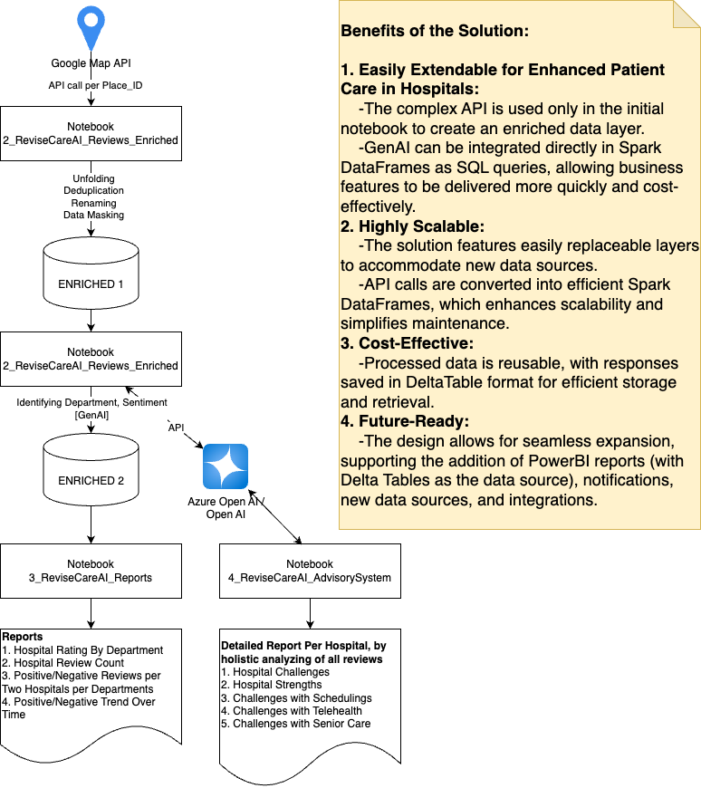
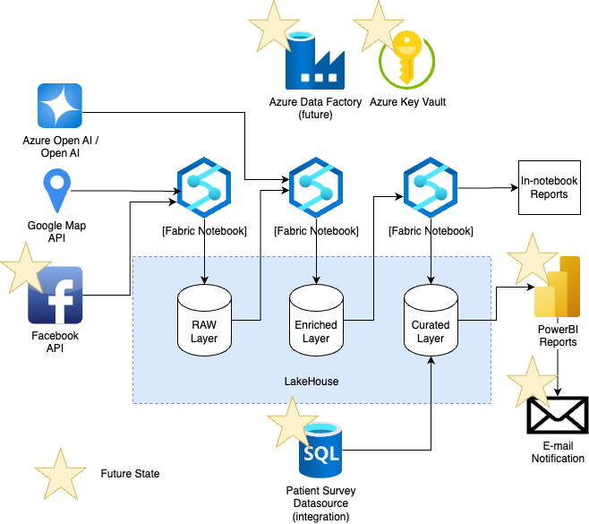

# ReviseCareAI
Project for Microsoft Hackaton on Healthcare, AI, DataEngineering

# How to Get Started
1) Install Azure Fabric Environment
2) Create a workspace
3) Create a lakehouse with the name "LAKEHOUSE"
4) Import all the notebooks from this REPO
5) Attach lakehouse to each imported notebook as a default. It is important, otherwise, the process will raise the Error because it doesn't understand the target or source location.
6) Inside workspace, create a custom environment, with two preinstalled public libraries:
- openai
- googlemaps
- ipywidgets
7) Be sure, all the notebooks have the previously created environment as a default. It is important, otherwise you will see the error message about missed module(s).
8) Update the notebook "0_ReviseCare_Secrets" with the right keys for Azure Open AI Key, and Google Map API Key. According to the best practices, one of the ways is to create a key vault and import them from the Key vault
9) Run the MASTER_NOTEBOOK to process all the data and gather new ones for the configured hospitals

10) If you need to reconfigure which Hospitals should be included, run the notebook "1_ReviseCareAI_HospitalsInitialization" and copy its input into the first cell of the 2_ReviseCareAI_Reviews_Enriched

# Data Flow Architecture Diagram of the Solution

# Component Diagram of the Solution

